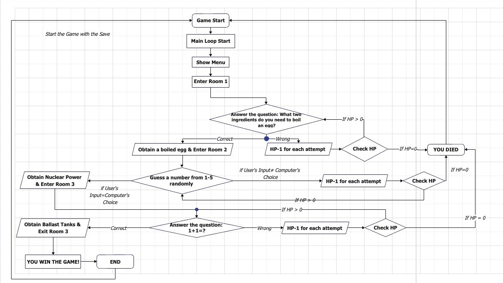

# CIS 1001 Group Project

Escape from undersea

## Requirement

A text-based adventure game based on leak of a submarine, **find 3 items** to win the game

## My idea

An **escape room** game(https://en.wikipedia.org/wiki/Escape_room), escaping from the leaking submarine (linear process)

## Discussion Question

Things to be discussed

- Game storyline

  - DDL; before thru's class

- Rooms in the Game

  - Engine Room
  - Sonar Room
  - Kitchen

- Items in the room

  - Boiled egg
  - Backup Nuclear Power
  - Backup Ballast tanks

- Puzzles to obtain the item

  - Puzzle 1: Boil an egg in kitchen
    - Wrong option HP-1


```
>(ask)How to boil an egg (items)
->hot water and raw egg
>Obtained a boiled egg
```

  - Puzzle 2:`random.choice()`(range 1-10) function to obtain nuclear power in control and engine room(you can make one room empty and reduce a large amount of blood) 

    - Wrong option HP-1

      ```
      choose a number from 1-5 that satisfy the number that computer choose
      if user's input = computer's choice
      item obtained
      ```

  - Puzzle 3: What is 1+1? to obtain ballast tanks

    ```
    Do I really need to explain that one???
    ```

    

## Structure of the game (Confirmed)

**Flowchart**



**Storyline of a game**

Tell a story of the game, also need to create items that needed to be found

**Art of the game** :

ASCII Art: a [graphic design](https://en.wikipedia.org/wiki/Graphic_design) technique that uses [computers](https://en.wikipedia.org/wiki/Computer) for presentation and consists of pictures pieced together from the 95 printable (from a total of 128) [characters](https://en.wikipedia.org/wiki/Character_(computing)) defined by the [ASCII](https://en.wikipedia.org/wiki/ASCII) Standard from 1963 and ASCII compliant character sets with proprietary extended characters (beyond the 128 characters of standard 7-bit ASCII).

e.g. ASCII Art Submarine

```
         _______
     ___/       \___
   /                   \
  |     - - - - - -     |
  |                     |
  |                     |
  |_______   _______|
          \_/
```


Plotting: Using `matplotlib` to create some figure (e.g. bar chart of HP)


### Game system

HP system: Every actions cost 1 hp, and there should be a first aid to recover

```
(after actions)
[name] took an action: Your HP is xxx
```


Save system: Save the game process in a `.txt` file

```
Name:
HP: xxx
Item: []
```


Actions: Go to a room, obtain items, solving puzzles, runs along with health system

```
(input room name)
[name] entered [room]
```


Win/lose system: Obtain 3 items to win/hp = 0 is lose

```
(If 3 items are collected)
(The end of the story line)

(If HP = 0)
You lose! (Restart the game)
```


Name: Ask the name and show the name to the HP Bar

```
Can I ask your name
(After input the name)
Hi! [name]! Welcome to the game!
```


Inventory: Check the inventory status of a player

```
Inventory:[a, b, c]
```


Help: Shows health condition and inventory

```
HP:
Inventory: []
```


Unless player press `exit` game restarts (loops) automatically after it finishes

```
exit
> stop the loop of the game and terminate the game
```


Eater egg: For fun!

- Print something out 

```
print an egg
      .-''-.
    .'       '.
   /    .-''-.  \
  /    /     \  \
  |   ;       |
  \   \     .-./
   '.  `'''`  .'
     '-.____.-'

-> boiled egg in the first lecture of CIS 1001.
```

```
     +--------+
     |        |
     |        |
     +--------+
->Nuclear Power
```

```
       ____      ______
     /     \    /       \
    /_______\  /_________\
   |   ___   ||   ___   |
   |  |   |  ||  |   |  |
   |  |___|  ||  |___|  |
   |         ||         |
   |         ||         |
   |_________||_________|
->Ballast tanks
```


## Document Management

I encourage to write `.py` files separately, there should be a `main.py` as a main part of the game and reference other files (or merge at last) to achieve function.

For example, the file list would look like

```
hp.py
main.py
room.py
save.py
```

If we would like to import from other `.py` files to `main.py`, it should be like

```python
from file import function
```

But, this is my expectation to have a better working efficiency. If it doesn't work, we'll still use a large `.py` file

## My Suggestion

Try to write the code by yourself, if you can't, ask tutor.

And also, try to google it before asking others, the solutions on the internet are very useful!

It would be really helpful to write some annotations in your code for others to check.

For example,  `#` is for annotation, use the annotation to explain the variables you defined.

```python
# Define circle area function a = \pi{r^2}
def radius(x):
    area = pi * x ** 2
    return(area)
```

If we found that it is hard to fulfill all the requirement of project, we can leave it. The major task is to **let the program run without major mistakes**.

Variables that will be commonly used shall be unified in group members

e.g.

```
(name) will be char_name
(HP) will be char_HP
or reference the function
```

## Parts needed to be separated
~~item~~ = completed

~~Health system and plotting: Guohua~~

~~Item 1: Puzzle 1+Room 4: Rinka~~

~~Item 2: Puzzle 2+Room 1,2: Yeonkyung~~

~~Item 3: Puzzle 3+Room 3: Shuntaro~~

~~Storyline+Flowchart: Heying~~

~~Save system:Sihan~~

~~Inventory system: Sihan~~

~~Main system: Guohua will do something first~~

~~- Actions system~~
~~- Win/lose system: Guohua~~

Storyline DDL: Before 6.29

Others: before 7.2 

## Presentation Slides
You will introduce your code based on your own function.
Link: https://docs.google.com/presentation/d/12BQsxsYnDQfdaxj-T8rMcdflZHLqsqbCPdiaB3zI340/edit?usp=sharing 

